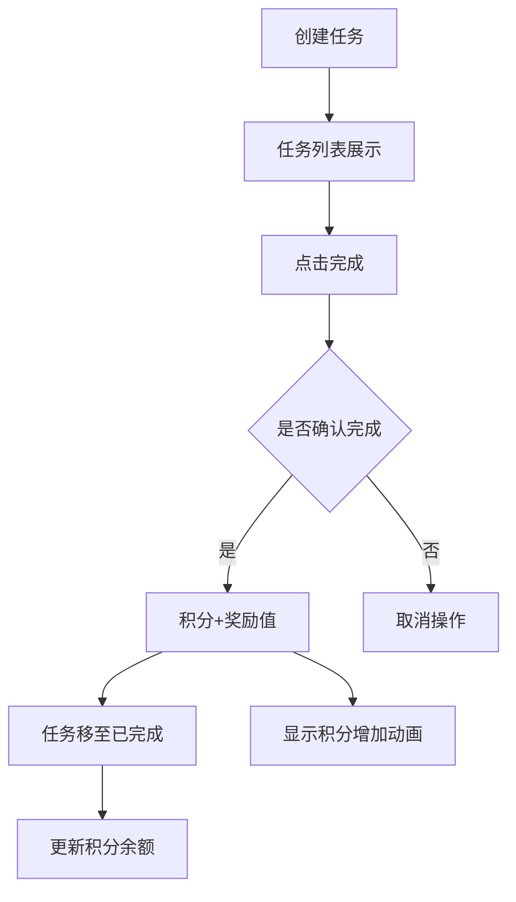
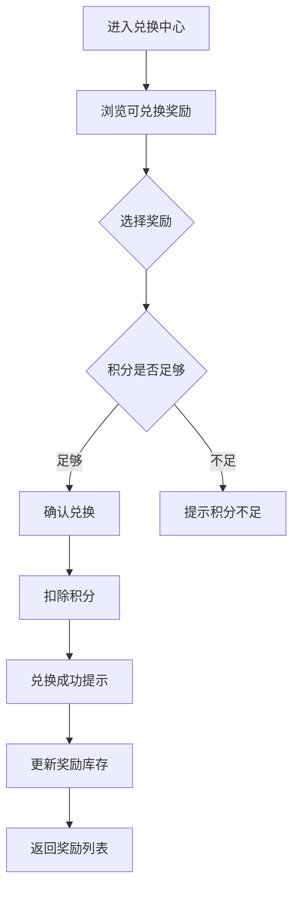

# 任务积分兑换应用 - 产品需求文档

## 1. 产品概述

一款简洁高效的个人任务管理与积分激励系统，帮助用户通过完成任务积累积分，并用积分兑换奖励。适用于个人习惯养成、目标追踪等场景。

### 主要功能
- 创建和管理日常任务
- 完成任务自动获得积分奖励
- 积分可兑换预设奖励
- 实时查看积分余额和历史记录

### 目标用户
- 个人用户进行自我管理和激励
- 追求简洁高效的用户

---

## 2. 核心功能

### 2.1 任务管理模块

#### 创建任务
- 输入任务名称
- 设置积分奖励值（默认10积分）
- 设置任务分类（可选）
- 支持任务优先级标记

#### 任务列表
- 显示所有待完成任务
- 标记完成按钮
- 删除任务功能
- 已完成任务自动归档

#### 任务完成
- 点击完成按钮
- 积分自动累加到账户
- 显示积分增加动画
- 任务状态更新

### 2.2 积分系统

#### 积分余额
- 顶部固定显示当前积分
- 积分变化动画效果
- 历史积分记录

#### 积分获取
- 完成任务自动获得设定积分
- 显示获取积分提示

### 2.3 兑换中心

#### 可兑换奖励列表
- 显示所有可用奖励
- 每个奖励显示所需积分
- 剩余库存/次数

#### 兑换功能
- 选择奖励进行兑换
- 积分足够时执行兑换
- 积分扣除并显示
- 兑换成功提示

#### 奖励管理
- 添加自定义奖励
- 设置奖励名称和所需积分
- 设置奖励库存/次数

---

## 3. 核心流程

### 任务完成积分获取流程

### 奖励兑换流程

---

## 4. 用户界面设计

### 4.1 设计风格

#### 视觉风格
- **风格定位**: 清新简约 + 现代化卡片设计
- **整体氛围**: 明亮、活泼、充满成就感
- **设计特点**: 圆润边角、柔和阴影、微动效反馈

#### 配色方案
- **主色调**: `#6366F1` (靛蓝紫 - 代表专注与智慧)
- **辅助色**: `#10B981` (翠绿色 - 代表成功与成长)
- **强调色**: `#F59E0B` (琥珀色 - 代表积分与价值)
- **背景色**: `#F8FAFC` (浅灰白 - 简洁舒适)
- **文字色**: `#1E293B` (深蓝灰 - 清晰易读)

#### 字体选择
- **标题字体**: "Nunito" (圆润友好)
- **正文字体**: "Inter" (清晰现代)
- **数字字体**: "JetBrains Mono" (等宽数字，适合积分显示)

#### 布局风格
- **整体布局**: 顶部导航 + 卡片式内容
- **导航设计**: 简洁Tab切换（任务 / 兑换 / 历史）
- **卡片设计**: 白色卡片 + 圆角 + 轻微阴影

#### 图标风格
- 使用 Lucide Icons（线性图标）
- 简洁、统一的线条风格

### 4.2 页面设计

#### 首页（任务列表）
| 模块 | 设计细节 |
|------|---------|
| 顶部栏 | 积分显示（图标+数字）、添加任务按钮 |
| 任务卡片 | 任务名、积分标签、完成/删除按钮 |
| 添加表单 | 任务输入框、积分输入、数字动画 |
| 完成动画 | 积分飞入动画、成功标记、庆祝微动效 |

#### 兑换中心
| 模块 | 设计细节 |
|------|---------|
| 奖励卡片 | 奖励图标/emoji、名称、所需积分、兑换按钮 |
| 兑换表单 | 添加新奖励表单（名称、积分、次数） |
| 兑换动画 | 积分扣除动画、兑换成功提示 |

#### 历史记录
| 模块 | 设计细节 |
|------|---------|
| 记录列表 | 时间、事件类型、积分变化（+/-）、余额 |
| 分类显示 | 积分获取（绿色+）、积分消耗（红色-） |

### 4.3 响应式设计
- **桌面端**: 居中容器，最大宽度 800px
- **平板端**: 全宽布局，适当增加间距
- **移动端**: 单列布局，触控友好的按钮尺寸

---

## 5. 数据管理

### 本地存储
- 使用 localStorage 持久化数据
- 自动保存所有操作
- 页面刷新数据不丢失

### 数据结构
- 任务列表（待完成/已完成）
- 积分余额
- 可兑换奖励列表
- 积分历史记录

---

## 6. 成功标准

1. ✅ 用户可以创建新任务并设置积分
2. ✅ 用户可以完成任务并获得积分
3. ✅ 积分余额实时更新并有动画反馈
4. ✅ 用户可以添加自定义兑换奖励
5. ✅ 用户可以用积分成功兑换奖励
6. ✅ 积分不足时给出明确提示
7. ✅ 数据持久化保存
8. ✅ 界面美观、交互流畅
