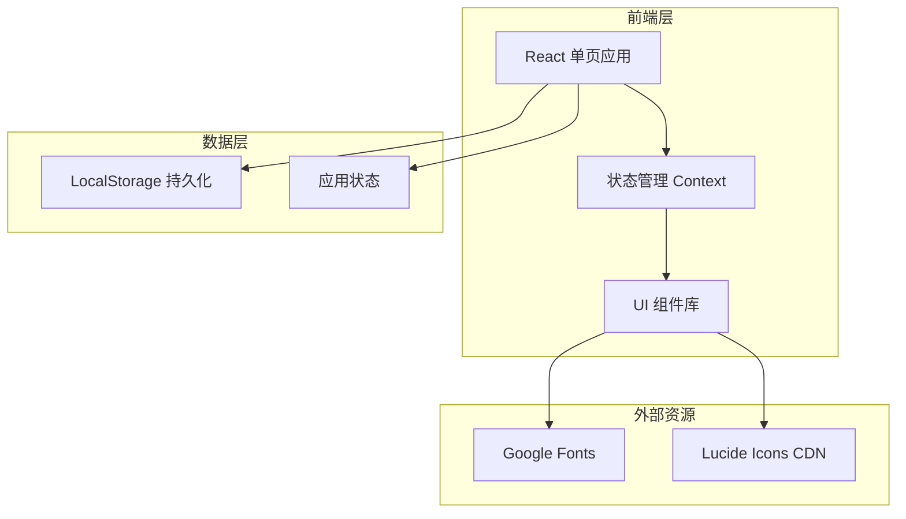

# 任务积分兑换应用 - 技术架构文档

## 1. 架构设计



## 2. 技术选型

### 前端框架
- **React**: 18.2.0 - 用于构建用户界面
- **Vite**: 5.0.0 - 现代化构建工具
- **JavaScript**: ES6+ - 编程语言

### 样式方案
- **Tailwind CSS**: 3.4.0 - 原子化CSS框架
- **CSS Variables**: 自定义主题色
- **PostCSS**: 自动处理

### 依赖库
- **lucide-react**: 0.294.0 - 图标库
- **react-hot-toast**: 2.4.1 - 轻量提示组件

### 数据存储
- **LocalStorage API**: 浏览器本地存储
  - tasks - 任务数据
  - rewards - 奖励数据
  - points - 积分余额
  - history - 积分历史

### 字体资源
- **Nunito**: 标题字体 (Google Fonts)
- **Inter**: 正文字体 (Google Fonts)
- **JetBrains Mono**: 数字字体 (Google Fonts)

## 3. 路由定义

单页应用，使用 Tab 切换显示不同模块：

| 路由/视图 | 用途 | 主要组件 |
|-----------|------|---------|
| /tasks | 任务列表 | TaskList, TaskForm, TaskCard |
| /rewards | 兑换中心 | RewardList, RewardForm, RewardCard |
| /history | 历史记录 | HistoryList, HistoryItem |

## 4. 数据模型

### 4.1 数据模型定义

```mermaid
erDiagram
    TASK {
        string id PK
        string name
        int points
        string category
        boolean completed
        datetime createdAt
        datetime completedAt
    }

    REWARD {
        string id PK
        string name
        int points
        int stock
        string emoji
        datetime createdAt
    }

    HISTORY {
        string id PK
        string type "earn" or "spend"
        string description
        int points
        int balanceAfter
        datetime timestamp
    }

    USER_STATE {
        int points
        datetime lastUpdated
    }
```

### 4.2 数据定义

```javascript
// 任务数据结构
{
  id: "uuid-string",
  name: "完成任务名称",
  points: 10,
  category: "日常",
  completed: false,
  createdAt: "2024-01-01T00:00:00Z",
  completedAt: null
}

// 奖励数据结构
{
  id: "uuid-string",
  name: "奖励名称",
  points: 100,
  stock: 5,
  emoji: "🎁",
  createdAt: "2024-01-01T00:00:00Z"
}

// 历史记录结构
{
  id: "uuid-string",
  type: "earn", // or "spend"
  description: "完成任务：xxx",
  points: 10,
  balanceAfter: 150,
  timestamp: "2024-01-01T00:00:00Z"
}

// 用户状态
{
  points: 100,
  lastUpdated: "2024-01-01T00:00:00Z"
}
```

## 5. 组件架构

```
src/
├── App.jsx                 # 主应用组件
├── index.css              # 全局样式和CSS变量
├── main.jsx               # 入口文件
├── context/
│   └── AppContext.jsx     # 全局状态管理
├── components/
│   ├── Header.jsx         # 顶部导航和积分显示
│   ├── TabNav.jsx         # Tab切换导航
│   ├── TaskList.jsx       # 任务列表组件
│   ├── TaskForm.jsx       # 创建任务表单
│   ├── TaskCard.jsx       # 任务卡片组件
│   ├── RewardList.jsx     # 奖励列表组件
│   ├── RewardForm.jsx     # 创建奖励表单
│   ├── RewardCard.jsx     # 奖励卡片组件
│   ├── HistoryList.jsx    # 历史记录列表
│   └── HistoryItem.jsx    # 历史记录单项
└── utils/
    └── storage.js         # LocalStorage工具函数
```

## 6. 核心函数

### 6.1 任务管理
```javascript
addTask(name, points, category)
completeTask(taskId) -> { success, newBalance }
deleteTask(taskId)
```

### 6.2 奖励管理
```javascript
addReward(name, points, stock, emoji)
redeemReward(rewardId) -> { success, message, newBalance }
```

### 6.3 积分管理
```javascript
getPoints()
addPoints(amount, description)
spendPoints(amount, description) -> { success, message }
```

### 6.4 历史记录
```javascript
addHistory(type, description, points, balanceAfter)
getHistory()
```

### 6.5 数据持久化
```javascript
saveToStorage(key, data)
loadFromStorage(key)
```

## 7. 状态管理

使用 React Context 实现全局状态管理：

```javascript
{
  points: number,
  tasks: Task[],
  rewards: Reward[],
  history: History[],
  addTask: Function,
  completeTask: Function,
  deleteTask: Function,
  addReward: Function,
  redeemReward: Function
}
```

## 8. 动画效果

### 积分增加动画
- 数字跳动效果 (count-up)
- 绿色 +N 提示
- 卡片完成打勾动画

### 积分扣除动画
- 数字减少效果
- 红色 -N 提示
- 兑换成功庆祝

### 列表动画
- 新增项目淡入
- 删除项目淡出
- Tab切换滑动效果

---

## 9. 开发工具

- **vite**: 项目初始化和开发服务器
- **npm**: 包管理器
- **浏览器开发者工具**: 调试

## 10. 浏览器兼容性

- Chrome 90+
- Firefox 90+
- Safari 14+
- Edge 90+
